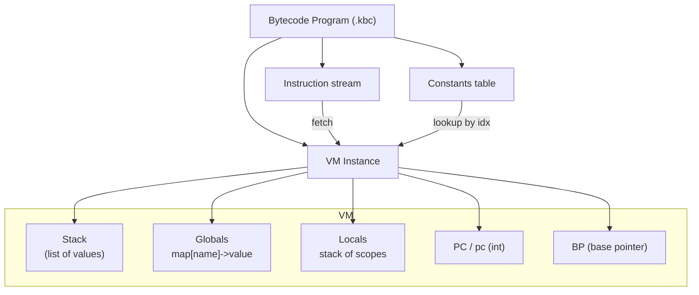
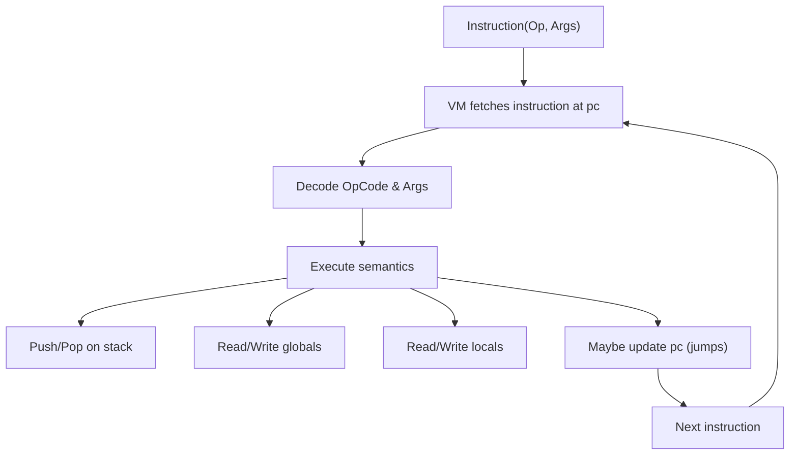

# Kode VM — Architecture & Internals

This document describes the internals of the Kode bytecode virtual machine (VM), how programs are represented, how the VM executes instructions, and the runtime data model.

Files referenced:
- Parser/AST: [internal/parser/parser.go](internal/parser/parser.go)
- AST definitions: [pkg/ast/ast.go](pkg/ast/ast.go)
- Bytecode compiler & buffer: [pkg/bytecode/compiler.go](pkg/bytecode/compiler.go) and [pkg/bytecode/bytecode.go](pkg/bytecode/bytecode.go)
- VM runtime: [pkg/bytecode/vm.go](pkg/bytecode/vm.go)

## High-level design

- The compiler emits a `Program` (see `Program` in `pkg/bytecode/bytecode.go`) containing:
  - `Constants []Value` — a constants pool (ints, floats, bools, strings, nil)
  - `Globals map[string]int` — mapping of global variable names to integer indices
  - `Instructions []Instruction` — sequence of `Instruction{Op OpCode, Args []interface{}}`
- The VM is a stack machine: instructions push and pop values on a value stack and mutate `globals` and `locals`.
- Execution is a single-threaded PC-driven loop implemented in `VM.Run()` (see `pkg/bytecode/vm.go`).

### VM diagrams





## VM structure (fields)

- `program *Program` — loaded program (constants/globals/instructions).
- `stack []interface{}` — value stack for operands and temporaries.
- `globals map[string]interface{}` — runtime storage for global vars (indexed via `program.Globals`).
- `locals []map[string]interface{}` — stack of local scopes for function calls / closures (indexed by synthetic names `_var_<n>`).
- `pc int` — program counter pointing into `program.Instructions`.
- `bp int` — base pointer (reserved in the VM struct; not heavily used currently).
- `functions map[string]*Program` — placeholder to store compiled function bodies (currently builtins/inlining used primarily).

(See `NewVM()` in [pkg/bytecode/vm.go](pkg/bytecode/vm.go) for initialization.)

## Execution loop

- The VM iterates `for vm.pc = 0; vm.pc < len(vm.program.Instructions); vm.pc++ { instr := vm.program.Instructions[vm.pc]; switch instr.Op { ... } }`.
- Each case implements the semantics of the opcode, usually by manipulating `vm.stack`, `vm.globals`, `vm.locals`, and `vm.pc`.
- Jump opcodes mutate `vm.pc` using signed offsets emitted by the compiler; the compiler emits placeholder offsets and patches them after layout.
- `OpHalt` returns from `Run()` with `nil` error, ending program execution.

## Value model and coercions

- Values are represented as Go `interface{}` and include `int`, `float64`, `bool`, `string`, `[]interface{}` (arrays), and `map[string]interface{}` (structs/enums).
- Numeric operations handle mixed `int`/`float64` with coercions:
  - If either operand is `float64`, arithmetic yields `float64`.
  - Bitwise ops operate on `int` only.
- Truthiness for conditional logic uses `isTruthy()`:
  - `bool` → boolean value, `int`/`float64` → non-zero true, `string` non-empty true, `nil` false, others true.

## Globals & Locals

- `program.Globals` is a map of name→index (emitted by the compiler). `OpLoadGlobal idx` finds the global name by index and pushes `vm.globals[name]`.
- `OpStoreGlobal idx` pops a value and stores it into `vm.globals[name]`.
- Local variables use `OpLoad`/`OpStore` with numeric indices and store values in the top `vm.locals` scope map under the key `_var_<index>`.
- `vm.locals` is a slice of maps to support nested scopes (push a new map on function entry, pop on return).

## Function calls & builtins

- `OpCall` has two args: function name (string) and argument count (int).
- The compiler handles builtins (`print`, `input`, etc.) specially; the VM's `OpCall` pops the args and delegates to `callBuiltin(name, args)` which returns a value pushed onto the stack.
- User functions are often inlined by the bytecode compiler for expression-bodied functions. The VM supports storing `functions map[string]*Program` (not fully used) and returns from `OpReturn`/`OpReturnValue` by returning from `Run()` (single-level behavior in current VM).

## Data structures: arrays, structs, enums

- Arrays are native `[]interface{}` created by `OpArrayCreate count` (pops `count` values and pushes an array in order).
- `OpArrayAccess` expects stack [array, index] and pushes the accessed element (supports `int` and `int64` indices).
- `OpArrayStore` expects [array, index, value] and writes into the array, then pushes the array back.
- Structs are created by `OpStructCreate structIdx, fieldCount` — the VM pops field-name constants and values and builds a `map[string]interface{}` with a `_type` meta entry and field keys.
- Enum variants are represented as `map[string]interface{}` with `_type`, `_variant`, and `_value` fields.

## Important opcodes (groups and semantics)

- Stack & locals:
  - `OpPush constIdx` — push constant at `program.Constants[constIdx]`.
  - `OpPop` — pop top value.
  - `OpDup` — duplicate top value.
  - `OpLoad` / `OpStore` — local variable access by index.
- Globals:
  - `OpLoadGlobal idx` / `OpStoreGlobal idx` — load/store globals via `program.Globals` index.
- Arithmetic & unary: `OpAdd`, `OpSub`, `OpMul`, `OpDiv`, `OpMod`, `OpNeg`, `OpIncr`, `OpDecr`.
- Bitwise: `OpBitAnd`, `OpBitOr`, `OpBitXor`, `OpBitNot`, `OpBitShl`, `OpBitShr` (operate on `int`).
- Comparison & logic: `OpEq`, `OpNe`, `OpLt`, `OpLte`, `OpGt`, `OpGte`, `OpAnd`, `OpOr`, `OpNot`.
- Control flow: `OpJmp offset`, `OpJmpIfFalse offset`, `OpJmpIfTrue offset`, `OpHalt`.
- Calls & returns: `OpCall name, argc`, `OpReturn`, `OpReturnValue`.
- Data: `OpArrayCreate n`, `OpArrayAccess`, `OpArrayStore`, `OpArrayLen`, `OpMemberAccess constIdx`, `OpStructCreate structIdx,count`, `OpEnumVariant enumIdx,varIdx`.
- IO/builtins: `OpPrint`, `OpInput`, `OpInputWithPrompt`.

See the full opcode list and definitions in [pkg/bytecode/bytecode.go](pkg/bytecode/bytecode.go).

## Bytecode layout & serialization

- `Program.Serialize()` writes:
  - Magic `"KODE"` (4 bytes)
  - Number of constants + constants (typed encoding)
  - Number of globals + sorted global name/index pairs
  - Instruction stream (count + serialized instructions — each instruction stores `Op` and typed `Args`).
- `Deserialize()` reconstructs `Program` via `Deserialize(data []byte)`.
- This enables persisting `.kbc` files and loading them later without re-parsing.

## Example: tiny execution trace

Source
```
let x = 3 + 5
print(x)
```
Bytecode (conceptual; the compiler emits `OpPush` / `OpAdd` / `OpStoreGlobal` / `OpLoadGlobal` / `OpPrint` / `OpPush(nil)` / `OpHalt`):
1. `OpPush constIdx(3)`
2. `OpPush constIdx(5)`
3. `OpAdd`            // pops 5, 3, pushes 8
4. `OpStoreGlobal idx(x)` // pops 8, stores globals["x"]=8
5. `OpLoadGlobal idx(x)`  // pushes 8
6. `OpPrint`          // pops 8, prints "8"
7. `OpPush constIdx(nil)` // print handler pushes nil as return value
8. `OpHalt`

VM stack evolution (snapshot after each step):
- []
- [3]
- [3,5]
- [8]
- [] (after store)
- [8]
- [] (after print)
- [nil]
- halt

## Builtins & host integration

- Builtins are implemented in the VM (`callBuiltin`) and include `print`, `len`, `int`, `float`, `string`.
- `print` prints via `fmt.Println` and returns `nil`.
- `input` and `inputWithPrompt` use `fmt.Scanln` and return a string.

## Current limitations & extension points

- Function frames are not fully implemented as separate `Program` frames with saved `pc`/`bp`; currently many user functions are inlined by the emitter. The `functions map[string]*Program` field exists for future support.
- `OpBreak`/`OpContinue` handling is minimal (may halt); compiler jump patching is responsible for generating correct loop exit / continue offsets.
- There is no GC — data is Go-managed; large programs can rely on Go's GC for heap values stored as `interface{}`.
- Concurrency constructs in the AST are not mapped to VM-level scheduling; they would require channels/threads on the VM side.

## Where to look in code

- VM loop & helpers: [pkg/bytecode/vm.go](pkg/bytecode/vm.go)
- Bytecode format: [pkg/bytecode/bytecode.go](pkg/bytecode/bytecode.go)
- Emitter that creates instructions: [pkg/bytecode/compiler.go](pkg/bytecode/compiler.go)

---

Generated on March 1, 2026.
