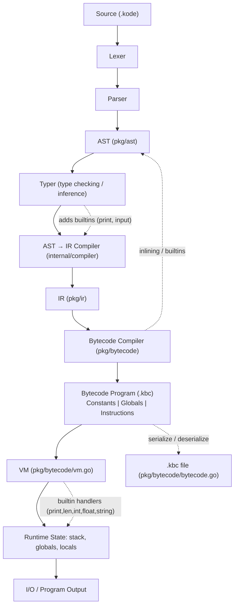

# Kode — Compilation & Execution Workflow

This document shows the end-to-end pipeline for Kode: how source is transformed and executed.


```

**Key files**

- Parser: [internal/parser/parser.go](internal/parser/parser.go)
- AST definitions: [pkg/ast/ast.go](pkg/ast/ast.go)
- Type checker / inference: [internal/typer/typer.go](internal/typer/typer.go)
- AST → IR compiler: [internal/compiler/compiler.go](internal/compiler/compiler.go)
- IR model: [pkg/ir/ir.go](pkg/ir/ir.go)
- Bytecode emitter: [pkg/bytecode/compiler.go](pkg/bytecode/compiler.go)
- Bytecode format & serialization: [pkg/bytecode/bytecode.go](pkg/bytecode/bytecode.go)
- VM runtime: [pkg/bytecode/vm.go](pkg/bytecode/vm.go)

**Notes**

- The bytecode `Program` contains a constants table, a globals map, and an instruction stream. It can be serialized to a `.kbc` file and deserialized back.
- The VM is a stack-based machine: instructions push/pop values and operate on a runtime `stack`, `globals`, and `locals` scopes.
- The compiler special-cases builtins like `print`/`input` and may inline simple expression-bodied functions.

**Next steps (suggestions)**

- Produce an annotated bytecode dump (constants, globals, instruction list) for `examples/basic.kode`.
- Walk a concrete example through parser → AST → IR → bytecode → VM stack trace.

---

Generated on March 1, 2026.
